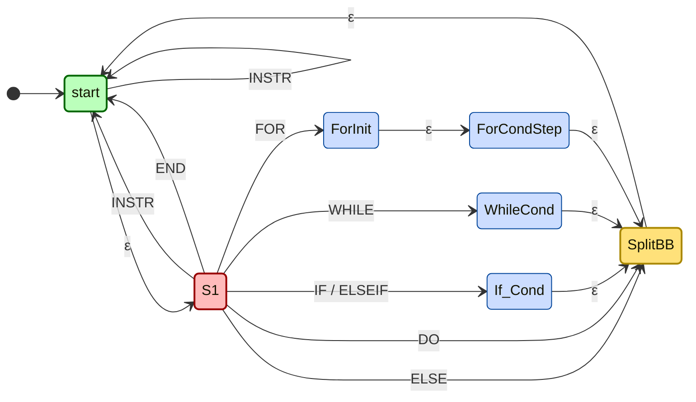

# Basic-Block Splitting Approach — v1

> Documents the grouping algorithm currently implemented in
> `src/main/java/com/ibm/wala/examples/newprogram/NewGraphVisualizer.java`. This is
> **v1** — it covers `if`/`else if`/`else`, `while`, `do-while`, and `for`; later
> versions may extend or revise it (e.g. `switch`, nesting-aware labeling). For how to
> read WALA's *raw* (unmerged) CFG output, see `vis-reading-instruction.md` — this
> document is about the merging/splitting layer on top of that.

---

## The problem

WALA's `SSACFG` splits a method into `ISSABasicBlock`s at the bytecode level, which
doesn't line up with how the source actually reads:

| Reason | What happens |
|---|---|
| **BB split at every call** | WALA ends a block at every method call (it's a *Potentially Excepting Instruction*), so one source line with two calls — or a string `+` (compiled to an `invokedynamic` call) — becomes two or more blocks. |
| **No control-flow role** | Every block prints the same way regardless of whether it's an `if` condition, a `for` header, or a loop body — there's no label distinguishing them. |

Printing WALA's blocks one-for-one (what `SimpleDecompile` does) is accurate but noisy.
`NewGraphVisualizer` groups these low-level blocks into **readable, control-flow-correct
basic blocks**: one group per real control-flow decision point or straight-line run of
code, each labeled with its role.

---

## The NFA mental model

The grouping rule was specified as this state machine (the user's own design, treating
class/method header lines as plain `INSTR` — no dedicated state):



Reading it: `start` is an accumulator that keeps folding plain (`INSTR`/`END`) tokens
into the current group. Any control keyword (`IF`/`ELSEIF`/`ELSE`/`WHILE`/`FOR`/`DO`)
forces the accumulator to close — the control-bearing token becomes its **own isolated
group** — and immediately after it (`SplitBB → start`) a **brand-new, empty**
accumulator begins for whatever follows. It never appends onto the keyword's own
group, even in cases (`else`, `do`, or a `for` loop's `i++` step — which re-resolves to
the same `for(...)` source line as the header) where a naive structural rule would
otherwise let it merge.

---

## The algorithm, 4 phases

`NewGraphVisualizer` implements this per method in four phases:

### 1. Resolve — `resolveAllBlocks`

Every block's SSA instructions are walked and resolved to source lines (SSA index →
bytecode index → `LineNumberTable` lookup, the same exact-debug-info technique used
throughout this tool family). Resolution is **raw** here — no deduplication yet;
consecutive fragments mapping to the same line are collapsed later, once, across the
whole merged group (phase 4) rather than per original sub-block.

### 2. Classify — `classifyAll` / `classify`

Each block is classified from its *first resolvable* source line's text:

```java
if (t.matches("^}?\\s*else\\s+if\\s*\\(.*")) return Kind.ELSEIF;  // checked before ELSE
if (t.matches("^}?\\s*else\\b.*"))            return Kind.ELSE;
if (t.matches("^if\\s*\\(.*"))                return Kind.IF;
if (t.matches("^}?\\s*while\\s*\\(.*"))       return Kind.WHILE;  // \}? covers do-while's "} while(...);"
if (t.matches("^for\\s*\\(.*"))               return Kind.FOR;
if (t.matches("^do\\b.*"))                     return Kind.DO;
return Kind.INSTR;                             // plain statements, "}"-only lines, class/method headers
```

`ELSEIF` is checked before `ELSE` because `else if (...)` also matches a bare `else`
prefix. `WHILE` tolerates a leading `}` so a do-while's tail condition (`} while
(cond);`) classifies correctly. Anything that isn't a recognized keyword — including
class and method header lines, per the NFA's explicit scope — falls through to
`INSTR`.

### 3. Group — `buildGroups` / `findMergeTarget`

Blocks are walked in WALA's natural number order and merged into the running group
only if **all six** conditions hold:

1. Not `ENTRY`/`EXIT`/`CATCH`.
2. Doesn't itself end in a conditional branch (`>1` normal successor).
3. Isn't itself classified as a control keyword.
4. Has exactly one normal predecessor (otherwise it's a join point).
5. That predecessor doesn't itself branch (`==1` normal successor).
6. That predecessor isn't itself a closed keyword group.

**The key insight**: conditions 1–2 and 4–5 alone (the pure structural rule, as used by
the earlier `OldGraphVisualizer` prototype) *already* correctly isolate `if`/`while`/
`for`-condition blocks (they always end in a real 2-successor branch) and `else`/`do`
targets (their one predecessor is a branch, so condition 5 blocks the merge). The
keyword override (conditions 3 and 6) is only load-bearing for **one** case: a `for`
loop's **init** block (`i = 2`) and **step** block (`i++`) each structurally look like
an ordinary single-pred/single-succ block and would otherwise merge into whatever
precedes or follows them, even though they semantically belong to the `for(...)`
header, not the surrounding code or the loop body.

### 4. Print — `printGroup` / `label`

Each group prints as: its label (`BB3+BB4+BB5` plus a role suffix — `ENTRY`/`EXIT`/
`CATCH` takes priority over a keyword role, which takes priority over no suffix), then
every member's phi/SSA instructions, then its resolved source line(s) **deduped once
across the whole group** (not per original sub-block — this is what avoids re-printing
the same line when a call/`invokedynamic` split it across several low-level WALA
blocks), then `-> ` edges to whichever group each external successor now belongs to.

---

## Worked example — `AnalysisClass.up(int)`

```java
public static long up(int n) {
    if (n <= 1) return n;               // line 7
    long[] dp = new long[n + 1];        // line 8
    dp[0] = 0;                          // line 9
    dp[1] = 1;                          // line 10
    for (int i = 2; i <= n; i++) {      // line 11
        dp[i] = dp[i - 1] + dp[i - 2];  // line 12
    }
    return dp[n];                       // line 14
}
```

produces exactly 10 groups:

| Group | Role | What it is |
|---|---|---|
| `BB0` | `[ENTRY]` | method entry |
| `BB1` | `[IF]` | the `if (n <= 1)` condition |
| `BB2` | `[IF]` | the `if`'s true branch (`return n;` — same source line as the condition) |
| `BB3+BB4+BB5` | plain | straight-line: `dp` allocation + two array stores (lines 8–10) |
| `BB6` | `[FOR]` | the loop's **init** (`i = 2`) — isolated from the body by the keyword override |
| `BB7` | `[FOR]` | the loop's **condition** check (`i <= n`) — already isolated structurally (2 successors, re-entered by both the init edge and the back-edge) |
| `BB8+BB9+BB10` | plain | the loop body (`dp[i] = dp[i-1] + dp[i-2];`, line 12) |
| `BB11` | `[FOR]` | the loop's **step** (`i++`) — isolated from the body by the keyword override, the other load-bearing case |
| `BB12+BB13` | plain | `return dp[n];` |
| `BB14` | `[EXIT]` | method exit |

This is the concrete case the keyword override exists for: without it, `BB6` would
merge backward into whatever precedes the loop and `BB11` would merge backward into
`BB8+BB9+BB10` (the body) — both structurally eligible under the pure structural rule
alone, but wrong once the `for(...)` header is meant to read as one distinct construct.

---

## v1 known limitations

- **Text/regex classifier, not a real parser.** Consistent with this tool family's
  existing "exact debug-info lookup, not reconstruction" philosophy (see
  `DecompileCFG.md`), but it means classification can only ever be as good as the
  resolved source line's literal text.
- **`else`/`do` often classify as `INSTR`, not `ELSE`/`DO`.** The bare keyword line
  itself usually has no bytecode/line-table entry — only the first real statement
  *inside* the branch/loop does. This only affects the printed **label**, never
  correctness: those blocks are already isolated from their predecessor by the
  structural rule regardless of what they're classified as.
- **`while`/`do-while`/`else`-`if` are implemented per the NFA spec but unverified by a
  live fixture** — the current test fixture (`AnalysisClass.java`) only exercises `if`
  and `for`. Reasoned through, not yet confirmed against real WALA output.
- **Requires source + debug info**, same constraint as the rest of this tool family —
  degrades to `"unavailable"` text when a class was compiled without a
  `LineNumberTable` or its `.java` source isn't found under `sourceDir`.

---

## Deep dive: `findMergeTarget` rule by rule

`findMergeTarget` is the NFA's **transition function**. For every basic block `bb` it
answers one question:

> **"Should this block glue onto the box its predecessor is already building (the
> *accumulator*), or start its own new box?"**

- Returns the **predecessor's group** → *merge* (glue on).
- Returns **`null`** → *start fresh* (own box).

The rule of thumb behind all six checks:

> **A block merges only if it's a boring, straight-line continuation. The moment
> anything *interesting* happens — a boundary, a branch, a join, or a keyword — it
> breaks off into its own box.**

It's written as six "escape hatches": if *any* check fails, we bail out with `null`
(start fresh). Only if **all six pass** do we merge. They group into three ideas.

### (a) Structural isolation — "is this block special by shape?"

**Rule 1 — not a boundary block** [check boundary]
```java
if (bb.isEntryBlock() || bb.isExitBlock() || bb.isCatchBlock()) return null;
```
ENTRY (the way in), EXIT (the way out), and CATCH (exception handler) are always their
own box. → *"Doorways and exception handlers never merge."*

**Rule 2 — doesn't itself branch** [check decision branch BB]
```java
if (cfg.getNormalSuccessors(bb).size() > 1) return null;
```
More than one outgoing arrow = this block ends in a **decision** (an `if`/`while`/`for`
condition). A fork in the road must stand alone. → *"If it ends by choosing between two
paths, keep it alone."*

### (b) NFA keyword override — "is its source line a keyword?"

**Rule 3 — the block isn't a control keyword** [check keyword header]
```java
if (kindOf.get(bb.getNumber()) != Kind.INSTR) return null;
```
This is the heart of the NFA. Even if a block *looks* mergeable by shape, if its source
line is `for`/`if`/`while`/etc. it's a **header** and starts fresh. → *"A keyword line is
a header — give it its own box."* This is the rule that isolates a `for`-loop's **init**
(`i = 2`) and **step** (`i++`) blocks: they don't branch, so Rule 2 wouldn't catch them,
but they belong to the `for(...)` header, so Rule 3 does.

### (c) A clean single parent — "where did it come from?"

**Rule 4 — exactly one arrow in** [check join point]
```java
if (preds.size() != 1) return null;
```
Two-or-more incoming arrows = a **join point** (where paths merge back — e.g. the line
after an `if/else`, or a loop header re-entered by its back-edge). Joins stand alone.
→ *"If two arrows point in, it's a meeting point — keep it separate."*

**Rule 5 — that one parent doesn't branch** [branch arm BB]
```java
if (cfg.getNormalSuccessors(pred).size() != 1) return null;
```
If my single parent forks to two children, then I'm one of its **branch arms** (a
then/else body). → *"If my parent forks, I'm one of its branches — start fresh."*

**Rule 6 — that parent is plain code, not a keyword box** [to confirm pred plain]
```java
if (kindOf.get(pred.getNumber()) != Kind.INSTR) return null;
```
You never append onto a keyword header's box. This is the NFA's *"SplitBB always starts
a brand-new accumulator."* → *"If my parent was a `for`/`if` header, don't glue me onto
it."*

**If all six pass:**
```java
return groupOf.get(pred.getNumber());   // join my parent's box
```

### Quick reference

| # | Rule | Code check | Fails when... | Idea group |
|---|---|---|---|---|
| 1 | Not a boundary block | `isEntryBlock() OR isExitBlock() OR isCatchBlock()` | block is ENTRY/EXIT/CATCH | (a) Structural isolation |
| 2 | Doesn't itself branch | `getNormalSuccessors(bb).size() > 1` | block ends in a decision (2+ outgoing edges) | (a) Structural isolation |
| 3 | Isn't itself a keyword block | `kindOf.get(bb.getNumber()) != Kind.INSTR` | block's source line is `if`/`for`/`while`/etc. — it's a header | (b) NFA keyword override |
| 4 | Exactly one predecessor | `preds.size() != 1` | block is a join point (2+ incoming edges) | (c) Clean single parent |
| 5 | Predecessor doesn't branch | `getNormalSuccessors(pred).size() != 1` | block is one arm of its parent's branch | (c) Clean single parent |
| 6 | Predecessor isn't a keyword block | `kindOf.get(pred.getNumber()) != Kind.INSTR` | parent is a closed `for`/`if`/etc. header — never glue onto it | (c) Clean single parent |

If all six pass: `return groupOf.get(pred.getNumber())` — merge into the parent's box.

### One-sentence version

> A block **continues its predecessor's box** only when it's a plain statement with
> **one arrow in and one arrow out**, where neither it nor its parent is a boundary, a
> branch, or a keyword — otherwise it **starts a new box**. In NFA terms: the `start`
> accumulator keeps folding `INSTR` tokens, and *any* structural or keyword event
> triggers `SplitBB → start`, opening a fresh accumulator.
